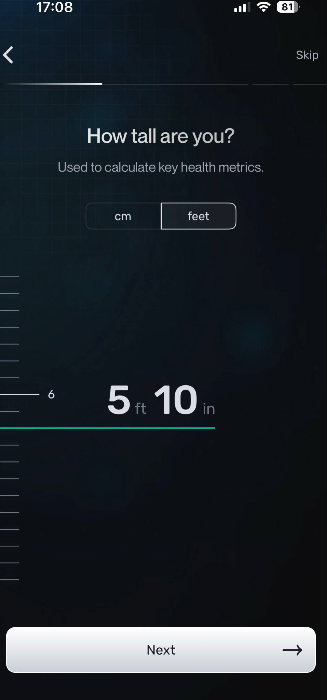
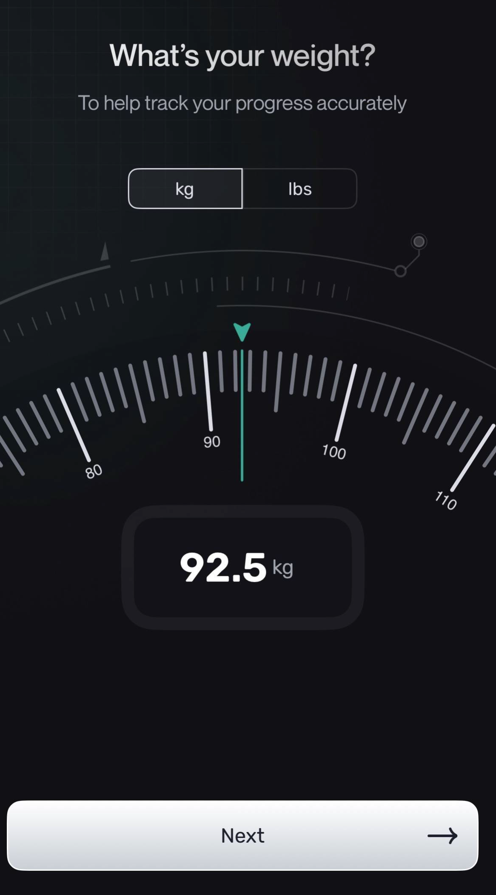
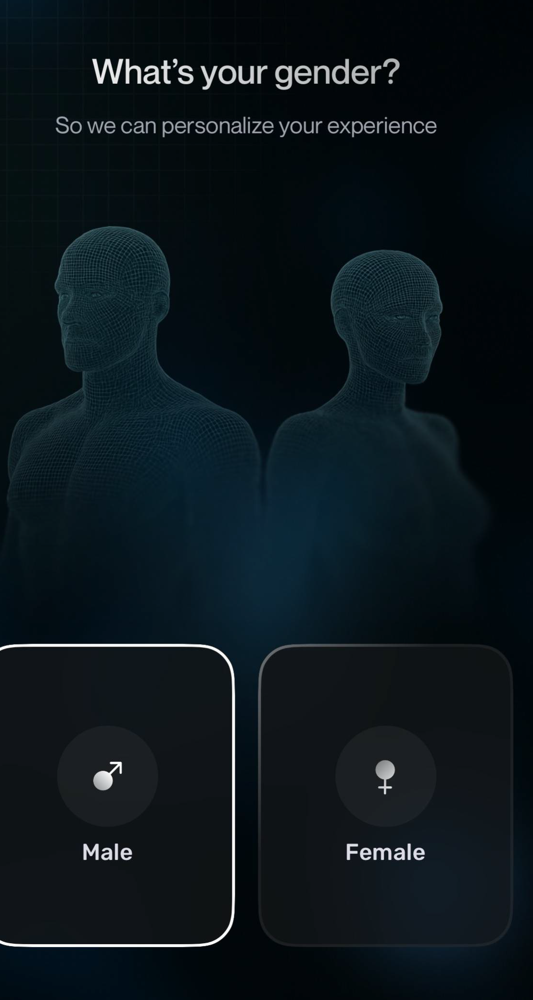
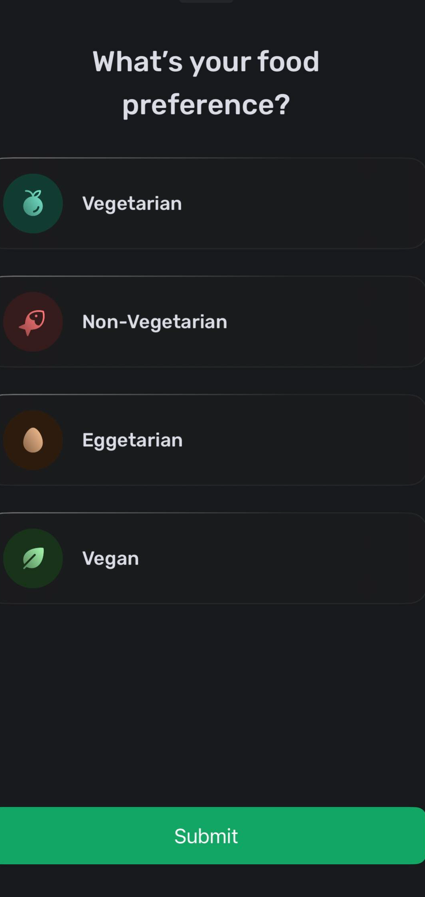

USER AUTHORIZATION / AUTHENTICATION

Fix - 
1. After a user is onboarded when user forgets the password and tries to click forget the password option the password reset mail is been sent to the registered mail ID but the reset password link is not actually reflecting in the user mail inbox (may be this feature wasn't set in the existing code base).

Feature - 
1. When a user tried to reset password without signing-in, will that user is been considered as a existing user ?, will that user get a reset password link even without he hadn't registed in our application/database ?
2. If a user hadn't signned up before in our application, and tries to hit a reset password with some mail id will the application logic / signup logic will check is this mail really existing in our data base and throw a error is doesnt exist ? The current behaviour is like, when a random user tries to hit forgot password and enter a mail id then click on send reset link, it is saying like "Check Your Email If an account exists with that email, we've sent a password reset link.", instead of this it should throw an error if the entered mail id was in wrong format or if the mail is not exist in data base this avoids unnessary triggers.
If this feature is not there in our existing logic then add it, if this exists then I apperciate your future vision implementation.


Good — now you’ve clarified your intent properly.
I’m going to **reconstruct entire product into a clean, phased, production-ready blueprint** 

1. Preserve every valid idea I gave
2. Correct technical misunderstandings
3. Remove contradictions
4. Organize into **clear product structure + phases + workflows**

---

# 🧠 FINAL PRODUCT DEFINITION (What you are building)

We are building a **personal discipline + nutrition + fitness tracking system** that:

* uses **BMI + goals to generate targets**
* tracks **food intake (macro-based)**
* tracks **daily discipline metrics**
* enforces **weekly activity balance**
* gives **visual progress + body state representation**
* allows **custom behavior tracking (user-defined metrics)**

This is NOT just a calorie tracker.
It is a **behavior correction + physical tracking system.**

---

# 🧱 PRODUCT STRUCTURE (Cleaned & Corrected)

---

# 🔷 PHASE 1 — CORE MVP (What you MUST build first)

This is the **minimum complete product** you can ship.

---

## 🔐 1. AUTH & USER CREATION

### Login methods

* Google Sign-in
* Email/password
* Phone number sign ups with OTP/whatsapp OTP authentication

### Google onboarding behavior

Auto-fill:

* name
* email

Stored in database immediately.

User does NOT retype.

In this method for any communication, we can communicate via user Mail ID

### Phone onboarding behavior

For user how tires to signin with Email/Password or Phone number method 
For this during signup onboarding process, the user should type their name (No auto-fill can happen here)
In this method for any communication, we can communicate via user's phone number (which will be stored in DB)

### Mail/Password onboarding behavior

For user how tires to signin with Email/Password method 
For this during signup onboarding process, the user should type their name (No auto-fill can happen here)
In this method for any communication/verification, we can communicate via user's email (which will be stored in DB)


What ever stored in DB like phone numbers/emailID of users that should be able to view in admin panel / for admins it should be visible. Rather than always login into DB we can get all the data on Admin page
---

## 👤 2. ONBOARDING FLOW (STRICT, MINIMAL, BUT COMPLETE)

### Step 1 — Basic Body Data

User enters using **interactive input UI**:

#### Height Input

* vertical scroll scale
* shows value in **cm**
* no negative values
* range starts from 0

Example:


#### Weight Input

* semicircle scroll (like weighing machine)
* scroll left-right
* values in **kg**
* starts from 0
* no negative values

Example:


#### Gender (mandatory)

* male / female


#### Diet Type (mandatory)

* vegetarian
* non-vegetarian
* vegan


👉 This is allowed because it directly affects food filtering and plan generation.

---

### Step 2 — BMI Calculation

System calculates:

```
BMI = weight / (height²)
```

Classification based on gender-adjusted health ranges (as per your requirement)

Display:

```
Actual BMI
Healthy BMI Range
Category (underweight / normal / overweight / obese)
```

---

### Step 3 — Goal Selection

User selects one:

* Weight Loss
* Weight Gain
* Body Recomposition

---

### Step 4 — Target Generation

System generates:

### Daily Targets

* Calories target
* Protein target
* Carbs target
* Fats target
* Fibre target
* Water intake target
* Sleep target
* Steps target

These become **locked daily targets** until goal changes.

---

## 📊 3. DASHBOARD (HOME)

User sees **Today Overview**

### Sections:

* Today's calories vs target
* Macro circles (Protein / Carbs / Fats / Fibre)
* Weight trend (7–30 days)
* Streak count
* Workout summary
* Water + sleep progress

### Always show:

👉 “Log today” CTA

---

## 🧾 4. DAILY LOG PAGE (CORE ENGINE)

### Mandatory fields (cannot be deleted)

* Calories consumed (with food logging)
* Protein
* Carbs
* Fats
* Fibre
* Steps
* Sleep
* Water
* Workout

### Optional fields

* Weight (user can remove)
* Custom user metrics

---

## 🍽️ 5. FOOD LOGGING SYSTEM

### Meals structure

* Breakfast
* Lunch
* Snack
* Dinner

Each meal has:

* search dropdown
* filtered based on diet type (veg / non-veg / vegan)
* food items stored per 100g

User selects:

* item
* grams consumed

System calculates:

* calories
* protein
* carbs
* fats
* fibre

All totals automatically added to daily log.

### Custom food entry allowed

User can add:

* custom food
* custom protein value (like protein shake)

---

## 🔵 6. MACRO PROGRESS UI (MANDATORY)

Under calories section:

Show 4 progress circles:

* Protein
* Carbohydrates
* Fats
* Fibre

Each shows:

```
Consumed vs Target %
```

---

## 🏋️ 7. WORKOUT TRACKING SYSTEM

Workout field becomes:

```
Workout Done? Yes / No
If Yes → Select type:
  - Weight Training
  - Cardio
  - Bodyweight Training
```

### Weekly Rule

System tracks:

User must perform **at least 2 types of workout per week** among the 3.

---

## 🧠 8. CUSTOM DAILY METRICS SYSTEM

User can create custom fields like:

* mobile usage hours
* sitting hours
* learning hours

Each field has:

* name
* unit
* value per day

Custom fields:

* persist across days
* user can delete them anytime

---

## 📏 9. BODY MEASUREMENTS PAGE (MONTHLY)

User logs:

* waist
* chest
* hips
* biceps etc.

### Rule:

* soft reminder every 30 days

---

## 🧍 10. BODY TYPE VISUAL MODEL (SIMPLIFIED)

Instead of dynamic model generation:

Use **predefined body models**:

Based on BMI category:

* underweight
* normal
* overweight
* obese

Each category has:

* male model
* female model

Display to user:
👉 “Your current body state”

This is **static dataset mapping**, not dynamic rendering.

---

## 📅 11. WEEKLY REVIEW SYSTEM

Every 7 days show:

* avg calories
* avg protein
* workouts done
* weight change
* consistency score

---

# 🔷 PHASE 2 — SMART SYSTEMS (After MVP launch)

Add intelligence features:

* automatic trend insights
* “you are missing protein frequently”
* adaptive calorie targets
* predictive logging (based on past meals)
* habit drift alerts

---

# 🔷 PHASE 3 — ADVANCED VISUAL SYSTEMS

This is where your **body model vision** can evolve:

* fat % estimation
* muscle % estimation
* visual transformation model
* avatar-based body representation

---

# 🧠 FINAL CONSOLIDATED USER FLOW

```
Signup → Google/email
↓
Quick onboarding (height, weight, gender, diet)
↓
BMI result + goal selection
↓
Targets generated
↓
Dashboard
↓
Daily log
   → food logging
   → macro tracking
   → workout logging
   → custom metrics
↓
Weekly review
↓
Monthly measurements
↓
Body model display
```

---

# ⚠️ CORRECTIONS APPLIED TO YOUR ORIGINAL IDEAS

| Your Idea                | Correction Applied                             |
| ------------------------ | ---------------------------------------------- |
| kg/lbs/cm/metre inputs   | Simplified to metric only                      |
| full world food database | Start with curated dataset                     |
| dynamic body model       | replaced with static category model            |
| unlimited field deletion | restricted to weight + custom fields only      |
| BMI uses gender          | corrected (gender used for plan, not BMI math) |

---

# 🏁 FINAL PRODUCT QUALITY

After restructuring:

```
Vision clarity: 10/10
UX flow: 9/10
Technical feasibility: 9/10
MVP scope control: 9/10
Execution readiness: 9/10
```

---

# 🎯 FINAL DIRECTIVE

You now have a **complete, structured MVP product plan**.


